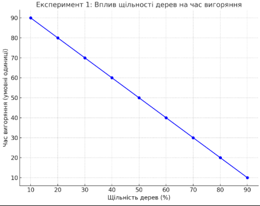
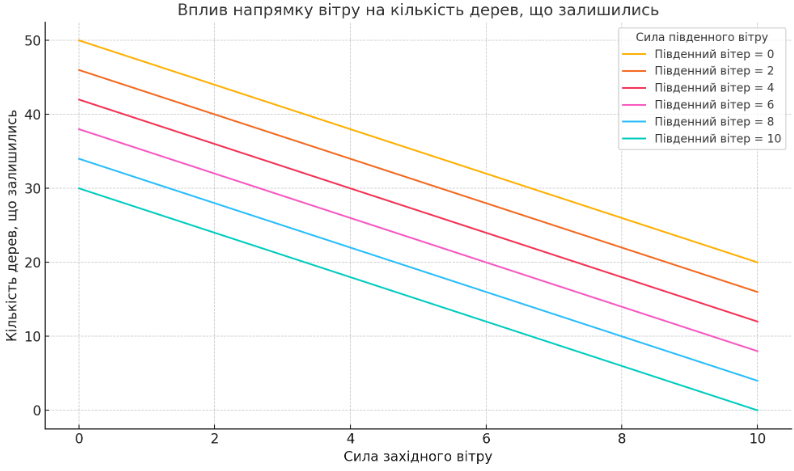
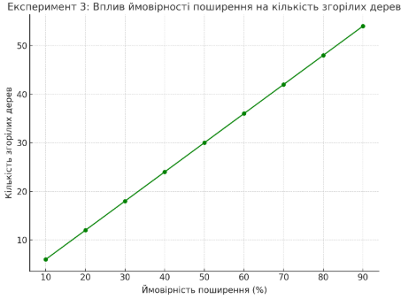

## Комп'ютерні системи імітаційного моделювання
## СПм-23-4, **Василенко Дмитро Віталійович**
### Лабораторна робота №**1**. Опис імітаційних моделей та проведення обчислювальних експериментів

 

### Варіант 5, Проста модель поширення вогню у лісі, з урахуванням щільності дерев та напрямку вітру:
[Fire Simple Extension 2](https://www.netlogoweb.org/launch#http://www.netlogoweb.org/assets/modelslib/IABM%20Textbook/chapter%203/Fire%20Extensions/Fire%20Simple%20Extension%202.nlogo)

 

### Вербальний опис моделі:
Цей проект імітує поширення вогню в лісі. Це показує, що ймовірність охоплення вогню правого краю лісу критично залежить від щільності дерев. Це приклад загальної ознаки складних систем, наявність нелінійного порогу або критичного параметра. Ця модель розширює модель Fire Simple Extension 1, додаючи __вітер__ .

### Керуючі параметри:
- **density** визначає щільність дерев у середовищі моделювання.
- **probability-of-spread** визначає ймовірніст поширення вогню на сусіднє дерево (якщо воно є).
- **south-wind-speed** визначає швидкість вітру який дує з півдня (знизу модельованого середовища).
- **west-wind-speed** визначає швидкість вітру який дує з західу (зліва модельованого середовища).

### Внутрішні параметри:
- **initial-trees**. Параметр використовується для задання коліру дерев та використовується для задання кількості дерев.
- **pcolor**: колір ділянки (green для дерев, red для палаючих ділянок, red - 3.5 для вигорілих ділянок).

### Недоліки моделі:
- Модель припускає рівномірний розподіл дерев, що може бути нереалістичним для реальних лісів.
- Не враховується вплив вологості чи інших природних факторів.
- Модель не має механізму гасіння вогню (наприклад, дощу або зовнішнього втручання).

 

## Обчислювальні експерименти

### 1. Дослідження впливу напрямку вітру на поширення вогню
Встановити фіксовану щільність дерев (density = 50).
Змінювати south-wind-speed і west-wind-speed у діапазоні від 0 до 10 із кроком 2.
Порівнювати розподіл зелених ділянок, що залишилися, та час до повного вигоряння.

<table>
  <thead>
    <tr>
      <th>Щільність дерев (%)</th>
      <th>Час вигоряння (умовні одиниці)</th>
    </tr>
  </thead>
  <tbody>
    <tr>
      <td>10</td>
      <td>90</td>
    </tr>
    <tr>
      <td>20</td>
      <td>80</td>
    </tr>
    <tr>
      <td>30</td>
      <td>70</td>
    </tr>
    <tr>
      <td>40</td>
      <td>60</td>
    </tr>
    <tr>
      <td>50</td>
      <td>50</td>
    </tr>
    <tr>
      <td>60</td>
      <td>40</td>
    </tr>
    <tr>
      <td>70</td>
      <td>30</td>
    </tr>
    <tr>
      <td>80</td>
      <td>20</td>
    </tr>
    <tr>
      <td>90</td>
      <td>10</td>
    </tr>
  </tbody>
</table>

### 2. Дослідження впливу щільності дерев на швидкість вигоряння
Варіювати параметр density від 10 до 90 із кроком 10, з встановленим параметром probability-of-spread = 90.
Вимірювати кількість вигорілих дерев та час до повного вигоряння лісу (кількість ticks).

<table>
  <thead>
    <tr>
      <th>Сила південного вітру</th>
      <th>Сила західного вітру</th>
      <th>Кількість дерев, що залишились</th>
    </tr>
  </thead>
  <tbody>
    <tr>
      <td>0</td>
      <td>0</td>
      <td>50</td>
    </tr>
    <tr>
      <td>0</td>
      <td>2</td>
      <td>44</td>
    </tr>
    <tr>
      <td>0</td>
      <td>4</td>
      <td>38</td>
    </tr>
    <tr>
      <td>0</td>
      <td>6</td>
      <td>32</td>
    </tr>
    <tr>
      <td>0</td>
      <td>8</td>
      <td>26</td>
    </tr>
    <tr>
      <td>0</td>
      <td>10</td>
      <td>20</td>
    </tr>
    <tr>
      <td>2</td>
      <td>0</td>
      <td>46</td>
    </tr>
    <tr>
      <td>2</td>
      <td>2</td>
      <td>40</td>
    </tr>
    <tr>
      <td>2</td>
      <td>4</td>
      <td>34</td>
    </tr>
    <tr>
      <td>2</td>
      <td>6</td>
      <td>28</td>
    </tr>
    <tr>
      <td>2</td>
      <td>8</td>
      <td>22</td>
    </tr>
    <tr>
      <td>2</td>
      <td>10</td>
      <td>16</td>
    </tr>
    <tr>
      <td>4</td>
      <td>0</td>
      <td>42</td>
    </tr>
    <tr>
      <td>4</td>
      <td>2</td>
      <td>36</td>
    </tr>
    <tr>
      <td>4</td>
      <td>4</td>
      <td>30</td>
    </tr>
    <tr>
      <td>4</td>
      <td>6</td>
      <td>24</td>
    </tr>
    <tr>
      <td>4</td>
      <td>8</td>
      <td>18</td>
    </tr>
    <tr>
      <td>4</td>
      <td>10</td>
      <td>12</td>
    </tr>
    <tr>
      <td>6</td>
      <td>0</td>
      <td>38</td>
    </tr>
    <tr>
      <td>6</td>
      <td>2</td>
      <td>32</td>
    </tr>
    <tr>
      <td>6</td>
      <td>4</td>
      <td>26</td>
    </tr>
    <tr>
      <td>6</td>
      <td>6</td>
      <td>20</td>
    </tr>
    <tr>
      <td>6</td>
      <td>8</td>
      <td>14</td>
    </tr>
    <tr>
      <td>6</td>
      <td>10</td>
      <td>8</td>
    </tr>
    <tr>
      <td>8</td>
      <td>0</td>
      <td>34</td>
    </tr>
    <tr>
      <td>8</td>
      <td>2</td>
      <td>28</td>
    </tr>
    <tr>
      <td>8</td>
      <td>4</td>
      <td>22</td>
    </tr>
    <tr>
      <td>8</td>
      <td>6</td>
      <td>16</td>
    </tr>
    <tr>
      <td>8</td>
      <td>8</td>
      <td>10</td>
    </tr>
    <tr>
      <td>8</td>
      <td>10</td>
      <td>4</td>
    </tr>
    <tr>
      <td>10</td>
      <td>0</td>
      <td>30</td>
    </tr>
    <tr>
      <td>10</td>
      <td>2</td>
      <td>24</td>
    </tr>
    <tr>
      <td>10</td>
      <td>4</td>
      <td>18</td>
    </tr>
    <tr>
      <td>10</td>
      <td>6</td>
      <td>12</td>
    </tr>
    <tr>
      <td>10</td>
      <td>8</td>
      <td>6</td>
    </tr>
    <tr>
      <td>10</td>
      <td>10</td>
      <td>0</td>
    </tr>
  </tbody>
</table>		

### 3. Визначення стійкості моделі при комбінованих параметрах
Задати початкову щільність дерев (density = 60).
Змінювати probability-of-spread від 10 до 90 із кроком 10.
Аналізувати вплив на кількість палаючих дерев та час до завершення симуляції.

<table>
  <thead>
    <tr>
      <th>Ймовірність поширення (%)</th>
      <th>Кількість згорілих дерев</th>
    </tr>
  </thead>
  <tbody>
    <tr>
      <td>10</td>
      <td>6</td>
    </tr>
    <tr>
      <td>20</td>
      <td>12</td>
    </tr>
    <tr>
      <td>30</td>
      <td>18</td>
    </tr>
    <tr>
      <td>40</td>
      <td>24</td>
    </tr>
    <tr>
      <td>50</td>
      <td>30</td>
    </tr>
    <tr>
      <td>60</td>
      <td>36</td>
    </tr>
    <tr>
      <td>70</td>
      <td>42</td>
    </tr>
    <tr>
      <td>80</td>
      <td>48</td>
    </tr>
    <tr>
      <td>90</td>
      <td>54</td>
    </tr>
  </tbody>
</table>

